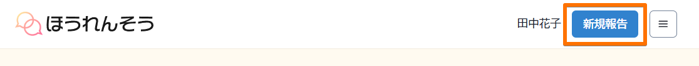
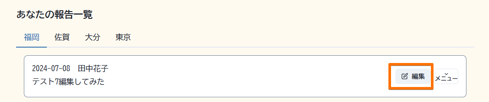
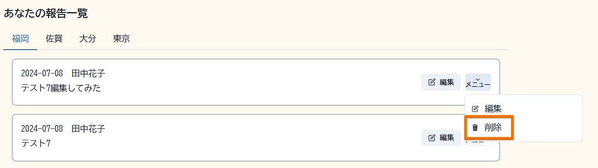
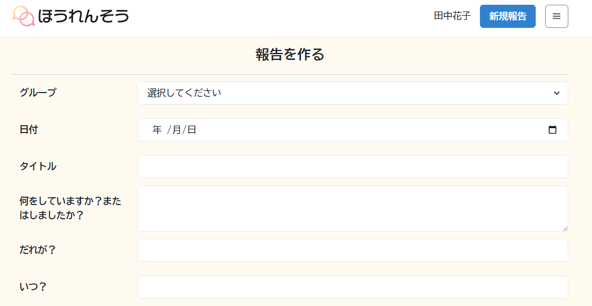
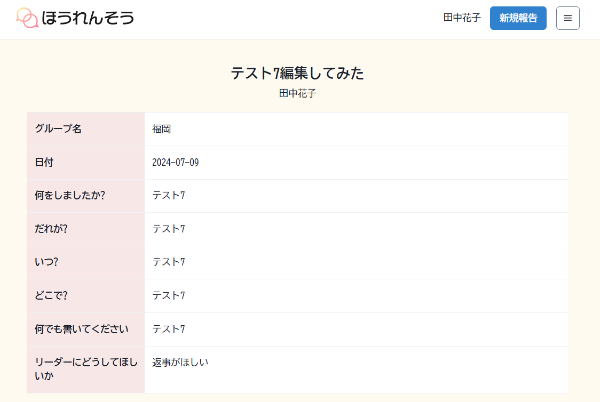
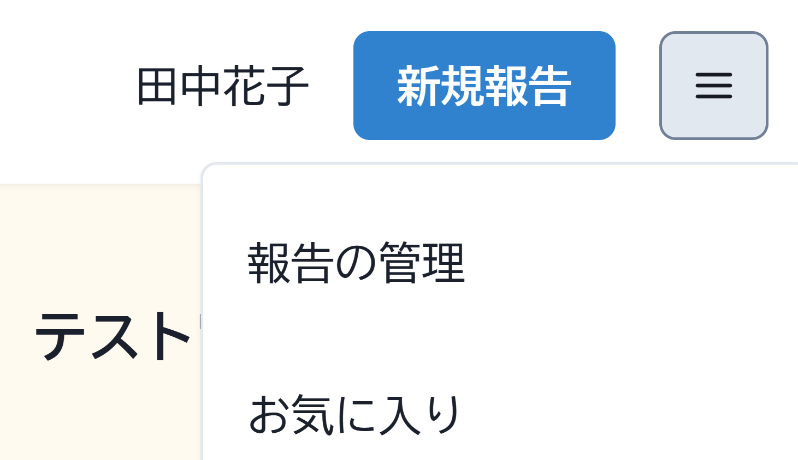

    

# アクセシビリティ対応日報アプリ「ほうれんそう」

障がい者雇用や合理的配慮がすすむなか、課題となる「報告・連絡・相談」に特化したアプリです。
当事者の働きやすさと、コミュニケーションに悩む会社の両方に役立ちます。

## 使い方

### 最初にアクセスするURL
https://shige-infra.info/login

デモ用ユーザーは２名分あります。好きな方を使ってログインしてください。

| ユーザーID | パスワード |
| ---------- | ---------- |
| hanako     | password   |
| taro       | password   |

### 新規投稿
ナビゲーションの「新規投稿ボタン」から投稿してください

### 編集
右上の「ハンバーガーメニュー」→「報告の管理」→「各記事の編集ボタン」

### 削除
右上の「ハンバーガーメニュー」→「報告の管理」→「各記事のメニュー」→「削除」

### その他
- 新規ユーザーの登録や削除はまちがいを防ぐため管理者が行います。

## 特徴
- かんたんに「報告（ほう）・連絡（れん）・相（そう）」ができる
- 自動的に「2Ｈ5Ｗ」「ほうれんそう」のスキルがみにつく
- 各障がいに対応（軽度知的/発達障害/視覚障害/色覚障害etc）
読み上げ機能を主とした様々な機能に対応できる情報設計・デザイン・フロント実装
- WCAG基準を目指します

### かんたんに2Ｈ5Ｗ「報告（ほう）・連絡（れん）・相（そう）」ができる

「自由に書いてといわれてもむずかしい」そんな声にお答えして、かんたんな項目別の入力にしました。
2Ｈ5Ｗにそって毎日かけば仕事の基礎を身につけることができます。

### 各障害に対応したアクセシビリティ

- ＜軽度知的障害＞難読漢字は使わず、やさしい表現を採用
- ＜読字障害＞UDフォントを採用した読みやすい字体
- ＜発達障害＞意識の負担をおさえるノイズを抑えたデザイン
- ＜視覚障がい＞余計な情報が入らない読み上げ音声を実現するフロント実装
- ＜色覚障がい＞メインのボタンに識別しやすい青、アラートにオレンジ（今後）を採用

＜視覚障がい対応＞2回のタブ移動で名前と新規投稿にたどりつくUX設計

＜視覚障がい対応＞超拡大に対応

## 機能のロードマップ

ほうれんそうアプリは機能を追加していく予定です。

### 日報機能

- [x] 投稿、編集、削除
- [ ] お気に入り機能
- [ ] 通知機能
- [ ] 既読機能
- [ ] 返信機能
- [ ] メールorLINE通知機能

### アクセシビリティ

- [x] 漢字
- [x] UDフォント
- [x] 色
- [x] 音声読み上げ
- [x]タブ移動
- [x] 超拡大
- [ ] ダークモード

## ライセンス

ライセンスは開発者に帰属します。
