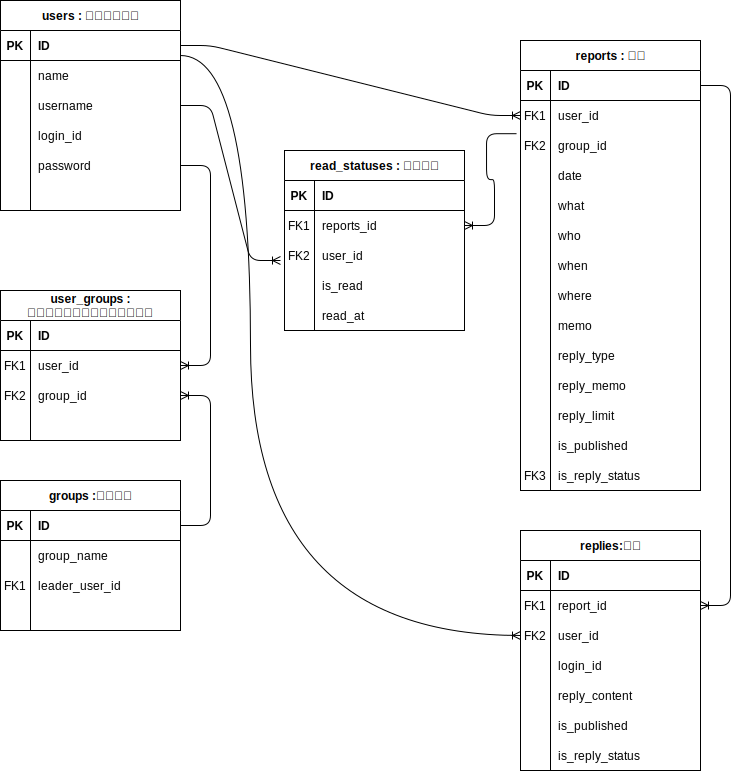

## 業務フロー

## 画面遷移図

## ワイヤーフレーム

## ER図

## テーブル定義書
### users
| PK  | FK  | 項目名     | 説明             | データ型     | 初期値            | NULL許容 | インデックス             |
| --- | --- | ---------- | ---------------- | ------------ | ----------------- | -------- | ------------------------ |
| 〇  |     | id         |                  | INT          |                   | NO       |                          |
|     |     | name       | 管理用の登録名   | VARCHAR(50)  |                   | NO       |                          |
|     |     | username   | 表示用ユーザー名 | VARCHAR(100) |                   | NO       | TRUE（ユーザ名高速表示） |
|     |     | login_id   | ログインID       | VARCHAR(50)  |                   | NO       |                          |
|     |     | password   | パスワード       | VARCHAR(100) |                   | NO       |                          |
|     |     | created_at | 管理者登録日時   | TIMESTANP    | CURRENT_TIMESTAMP | NO       |                          |
|     |     | undated_at | 管理者更新日     | TIMESTANP    | CURRENT_TIMESTAMP | NO       |                          |
#### ユニーク制約
- username (ユーザー名はユニークでなければならない)
- login_id (ログインIDはユニークでなければならない)
#### その他の制約
- password (パスワードには最低8文字以上の制約を設ける)

### groups
| PK  | FK                    | 項目名         | 説明                         | データ型     | 初期値 | NULL許容 | インデックス                           |
| --- | --------------------- | -------------- | ---------------------------- | ------------ | ------ | -------- | -------------------------------------- |
| 〇  |                       | id             |                              | INT          |        | NO       |                                        |
|     |                       | group_name     | グループ名                   | VARCHAR(100) |        | NO       |                                        |
|     | 〇（usersテーブルID） | leader_user_id | グループリーダーのユーザーID | INT          |        | YES      | TRUE（リーダーユーザーID検索の高速化） |
#### ユニーク制約
- group_name (グループ名はユニークでなければならない)

### user_groups
| PK  | FK                     | 項目名   | 説明                                       | データ型 | 初期値 | NULL許容 | インデックス |
| --- | ---------------------- | -------- | ------------------------------------------ | -------- | ------ | -------- | ------------ |
| 〇  |                        | id       |                                            | INT      |        | NO       |              |
|     | 〇（usersテーブルID）  | user_id  | ユーザーIDの外部キー(usersテーブルを参照)  | INT      |        | NO       |              |
|     | 〇（groupsテーブルID） | group_id | グループIDの外部キー(groupsテーブルを参照) | INT      |        | NO       |              |
#### ユニーク制約
- user_id, group_id (ユーザーとグループの組み合わせはユニークでなければならない)
#### 追加
- user_id, group_id (ユーザーとグループの組み合わせでindexを設定)

### reports
| PK  | FK                            | 項目名           | 説明                                       | データ型     | 初期値                  | NULL許容 | インデックス                                       |
| --- | ----------------------------- | ---------------- | ------------------------------------------ | ------------ | ----------------------- | -------- | -------------------------------------------------- |
| 〇  |                               | id               |                                            | INT          |                         | NO       |                                                    |
|     | 〇（usersテーブルID）         | user_id          | ユーザーIDの外部キー(usersテーブルを参照)  | INT          |                         | NO       | user_id (ユーザーIDでの検索を高速化)               |
|     | 〇（groupsテーブルID）        | group_id         | グループIDの外部キー(groupsテーブルを参照) | INT          |                         | NO       | group_id (グループIDでの検索を高速化)              |
|     |                               | date             | レポートの日付                             | DATE         |                         | NO       |                                                    |
|     |                               | what             | レポートの内容(実施した作業など)           | TEXT         |                         | NO       |                                                    |
|     |                               | who              | 実施者                                     | VARCHAR(100) |                         | YES      |                                                    |
|     |                               | when             | 実施した時期                               | VARCHAR(100) |                         | YES      |                                                    |
|     |                               | where            | 場所                                       | VARCHAR(100) |                         | YES      |                                                    |
|     |                               | memo             | メモ                                       | TEXT         |                         | YES      |                                                    |
|     |                               | reply_type       | 返事の種類（ラジオボタン選択）             | TINYINT      |                         | YES      |                                                    |
|     |                               | reply_memo       | 返信に対するメモ                           | TEXT         |                         | YES      |                                                    |
|     |                               | reply_limit      | 返信期限                                   | DATETIME     |                         | YES      |                                                    |
|     |                               | reply            | 返信内容                                   | TEXT         |                         | YES      |                                                    |
|     | 〇（usersテーブルの外部キー） | reply_user_id    | 返信者のユーザーID                         | INT          |                         | YES      | reply_user_id (返信者のユーザーIDでの検索を高速化) |
|     |                               | reply_created_at | 返信作成日時                               | DATETIME     |                         | YES      |                                                    |
|     |                               | is_reply_status  | 返信の完了状態 0:未完了,  1 : 完了         | BOOLEAN      | false（登録時は未完了） | NO       |                                                    |
|     |                               | is_published     | 報告の公開状態 0:下書き, 1:公開            | BOOLEAN      |                         | NO       |                                                    |                      |
#### インデックス制約
- 追加：(user_id, group_id) (ユーザーIDとグループIDの組み合わせでの検索を高速化)

### replies
| PK  | FK  | 項目名          | 説明                                        | データ型 | 初期値                  | NULL許容 | インデックス                         |
| --- | --- | --------------- | ------------------------------------------- | -------- | ----------------------- | -------- | ------------------------------------ |
| 〇  |     | id              |                                             | INT      |                         | NO       |                                      |
|     | FK1 | reports_id      | レポートIDの外部キー(reportsテーブルを参照) | INT      |                         | NO       | user_id (ユーザーIDでの検索を高速化) |
|     | FK2 | user_id         | ユーザーIDの外部キー(usersテーブルを参照)   | INT      |                         | NO       | user_id (ユーザーIDでの検索を高速化) |
|     |     | reply_content   | 返信内容                                    | TEXT     |                         | YES      |                                      |
|     |     | is_published    | 報告の公開状態 0:下書き, 1:公開             | BOOLEAN  | false（登録時は下書き） | NO       |                                      |
|     |     | is_reply_status | 返信の完了状態 0:未完了, 1 : 完了           | BOOLEAN  | false（登録時は未完了） | NO       |                                      |
#### インデックス制約
- 追加：(user_id, group_id) (ユーザーIDとグループIDの組み合わせでの検索を高速化)

### read_statuses
| PK  | FK  | 項目名     | 説明                                                          | データ型 | 初期値      | NULL許容 | インデックス                            |
| --- | --- | ---------- | ------------------------------------------------------------- | -------- | ----------- | -------- | --------------------------------------- |
| 〇  |     | id         |                                                               | INT      |             | NO       |                                         |
|     | FK1 | reports_id | レポートIDの外部キー(reportsテーブルを参照)                   | INT      |             | NO       | reports_id (レポートIDでの検索を高速化) |
|     | FK2 | user_id    | ユーザーIDの外部キー(usersテーブルを参照)                     | INT      |             | NO       | user_id (ユーザーIDでの検索を高速化)    |
|     |     | is_read    | レポートが読まれたかどうかのフラグ(TRUE: 読んだ、FALSE: 未読) | BOOLEAN  | FALSE: 未読 | NO       |                                         |
#### インデックス制約
- 追加：(reports_id, user_id) (レポートIDとユーザーIDの組み合わせでの検索を高速化)

## システム構成図

