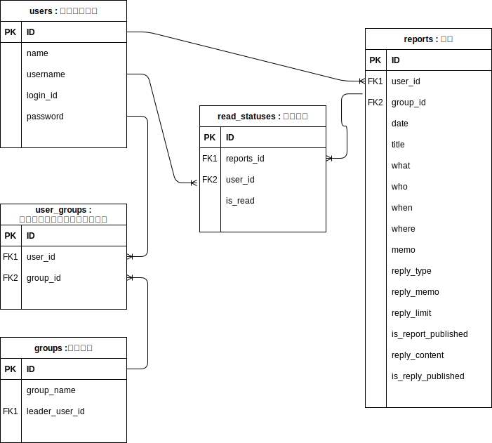

## 業務フロー

## 画面遷移図

## ワイヤーフレーム

## ER図

## テーブル定義書
### users : ユーザー定義
| PK  | FK  | 項目名     | 説明             | データ型     | 初期値            | NULL許容 | インデックス             |
| --- | --- | ---------- | ---------------- | ------------ | ----------------- | -------- | ------------------------ |
| 〇  |     | id         |                  | INT          |                   | NO       |                          |
|     |     | name       | 管理用の登録名   | VARCHAR(50)  |                   | NO       |                          |
|     |     | username   | 表示用ユーザー名 | VARCHAR(100) |                   | NO       | TRUE（ユーザ名高速表示） |
|     |     | login_id   | ログインID       | VARCHAR(50)  |                   | NO       |                          |
|     |     | password   | パスワード       | VARCHAR(100) |                   | NO       |                          |
|     |     | created_at | 管理者登録日時   | TIMESTANP    | CURRENT_TIMESTAMP | NO       |                          |
|     |     | undated_at | 管理者更新日     | TIMESTANP    | CURRENT_TIMESTAMP | NO       |                          |

### groups : グループ
### user_groups : ユーザーグループ中間テーブル
### reports : 報告
### read_statuses : 既読管理

## システム構成図

